# How to Play NPZR (Ninja Pirate Zombie Robot)

## Game Overview

NPZR is a tactical two-player card game where you compete to be the first to collect one complete character of each type: **Ninja**, **Pirate**, **Zombie**, and **Robot**. Build characters by collecting matching head, torso, and leg cards while strategically blocking your opponent!

## Game Components

### The Deck (44 Cards Total)
- **36 Regular Cards**: 4 characters × 3 body parts × 3 copies each
- **8 Wild Cards**: Special cards that can substitute for missing pieces

### Card Types
- **Regular Cards**: Specific character body parts (e.g., "Ninja Head", "Robot Legs")
- **Wild Cards**: Can be nominated as any character/body part combination
  - **Character Wilds** (4): Any body part for a specific character
  - **Position Wilds** (3): Any character for a specific body part  
  - **Universal Wild** (1): Any character and any body part

## Setup

1. **Shuffle** the 44-card deck
2. **Deal 5 cards** to each player
3. **Place remaining deck** face-down as the draw pile
4. **Choose starting player** randomly

## Objective

Be the first player to score **one complete character of each type**:
- ✅ One complete Ninja (head + torso + legs)
- ✅ One complete Pirate (head + torso + legs)  
- ✅ One complete Zombie (head + torso + legs)
- ✅ One complete Robot (head + torso + legs)

## Turn Sequence (Sequential Play System)

```mermaid
sequenceDiagram
    participant P as Player
    participant D as Deck
    participant H as Hand
    participant T as Table
    participant O as Opponent
    
    Note over P,O: Player's Turn - Sequential Card Play
    
    rect rgb(240, 248, 255)
        Note over P,D: 1. Draw Phase
        P->>D: Draw one card
        D->>H: Card goes to hand
    end
    
    rect rgb(255, 248, 240)
        Note over P,T: 2. Play First Card
        P->>H: Choose a card to play
        H->>T: Place card on a stack
        
        alt Stack becomes complete (head + torso + legs match)
            T->>P: Stack completed! Character scored
            T->>T: Remove completed stack from table
            Note right of T: Player earns 1 move
            
            opt Player chooses to use move
                P->>T: Move any card between stacks
                alt Moving creates another completion
                    T->>P: Another character scored!
                    T->>T: Remove newly completed stack
                    Note right of T: Player earns another move
                end
            end
        end
    end
    
    rect rgb(248, 255, 248)
        Note over P,H: 3. Check for Wild Cards
        alt Last played card was a Wild Card
            Note over P,O: Player can play another card!
            P->>H: Choose another card (wild or regular)
            H->>T: Place card on a stack
            
            alt This stack becomes complete
                T->>P: Another character scored!
                T->>T: Remove completed stack
                Note right of T: Player earns 1 move
                
                opt Player uses the move
                    P->>T: Move any card between stacks
                    alt Move creates completion
                        T->>P: Chain reaction! More points
                        T->>T: Remove stack
                        Note right of T: Earn another move
                    end
                end
            end
            
            alt Card was another Wild Card
                Note over P,T: Can play yet another card!
                Note right of P: Wild cards extend your turn
            else Card was Regular
                Note over P,O: Turn ends after resolving moves
            end
        else Last card was Regular
            Note over P,O: Turn ends - no more cards allowed
        end
    end
    
    rect rgb(255, 240, 245)
        Note over P,O: 4. Turn Complete
        alt Player has all 4 characters (Ninja, Pirate, Zombie, Robot)
            Note over P,O: GAME WON! 🎉
        else
            Note over O,P: Opponent's turn begins
        end
    end
    
    Note over P,O: Key Rules:<br/>• Wild cards let you play more cards<br/>• Completions earn moves immediately<br/>• Moves can create chain reactions<br/>• Regular cards end your turn
```

## Detailed Turn Rules

### 1. Draw Phase
- **Always draw exactly 1 card** from the deck to start your turn
- If the deck is empty, shuffle all scored characters back into a new deck

### 2. Card Play Phase (Sequential)
- **Play exactly 1 card** from your hand
- **Choose target**: Either create a new stack OR add to an existing stack
- **Immediate resolution**: Check for stack completion right away

#### Stack Completion
A stack is **complete** when it has matching head, torso, and legs of the same character:
- All three cards must represent the same character (considering wild card nominations)
- **Immediate scoring**: Remove the completed stack and add the character to your score
- **Earn 1 move**: Every completion gives you exactly one move to use

### 3. Move Phase (If Earned)
If you completed a stack, you **immediately earn 1 move**:
- **Move any single card** from any stack to any other position
- **Chain reactions**: Moving a card might complete another stack
- **Cascading moves**: New completions earn additional moves
- **No limit**: Chain reactions can continue indefinitely

### 4. Wild Card Continuation
- **If your last played card was a Wild Card**: You may play another card (go back to step 2)
- **If your last played card was Regular**: Your turn ends after resolving any moves
- **Wild card chains**: You can play multiple wild cards in sequence to extend your turn

## Card Placement Rules

### Where You Can Play Cards
- **New Stack**: Create a new stack anywhere on the table
- **Your Stacks**: Add to any of your existing stacks
- **Opponent's Stacks**: Add to your opponent's stacks (defensive play!)

### Stack Organization
- Each stack has **3 piles**: Head, Torso, Legs
- Cards are placed on top of existing cards in each pile
- Only the **top card** of each pile counts for completion

## Wild Card Rules

### Nomination System
- **When played**: Wild cards must be nominated (declare what they represent)
- **Example**: "This Universal Wild is now a Ninja Head"
- **When moved**: Wild cards lose their nomination and become wild again
- **Re-nomination**: Can be nominated differently when played again

### Wild Card Types
1. **Character Wilds** (4 cards): Can be any body part for their specific character
   - Ninja Wild → any Ninja body part
   - Pirate Wild → any Pirate body part
   - Zombie Wild → any Zombie body part  
   - Robot Wild → any Robot body part

2. **Position Wilds** (3 cards): Can be any character for their specific body part
   - Head Wild → any character's head
   - Torso Wild → any character's torso
   - Legs Wild → any character's legs

3. **Universal Wild** (1 card): Can be any character and any body part
   - Most powerful and flexible card in the game

## Strategic Elements

### Offensive Strategy
- **Build efficiently**: Focus on completing characters you're closest to finishing
- **Wild card timing**: Use wild cards to extend turns and create big combo plays
- **Move optimization**: Use earned moves to set up future completions

### Defensive Strategy
- **Block opponents**: Play cards on their stacks to prevent completion
- **Resource denial**: Take wild cards they need for their builds
- **Timing disruption**: Force them to complete less valuable characters first

### Advanced Tactics
- **Cascade planning**: Set up multiple stacks to create chain reaction opportunities
- **Wild card conservation**: Save powerful wilds for game-winning combinations  
- **Stack manipulation**: Use moves to break up opponent advantages
- **Tempo control**: Balance offense and defense based on game state

## Winning the Game

### Victory Condition
First player to score **all 4 character types** wins immediately:
- ✅ Ninja (any combination of head + torso + legs)
- ✅ Pirate (any combination of head + torso + legs)  
- ✅ Zombie (any combination of head + torso + legs)
- ✅ Robot (any combination of head + torso + legs)

### Important Notes
- **Immediate win**: Game ends the moment a player scores their 4th character type
- **Multiple copies allowed**: You can score the same character multiple times
- **Move cascade wins**: Victory can occur during move chain reactions

## Game Variants

### Quick Play
- Start with 7 cards instead of 5
- First to 3 different characters wins

### Extended Game  
- First to 2 complete sets (8 characters total) wins
- Adds more strategic depth and longer gameplay

### Draft Mode
- Each player sees 10 cards and drafts 5 alternately
- Play with drafted hands for more strategic control

## Tips for New Players

1. **Learn the wild cards**: Understanding wild card types is crucial for success
2. **Watch opponent stacks**: Always consider defensive plays
3. **Plan your moves**: Think about cascade opportunities before playing
4. **Wild card timing**: Save wilds for turn extension when you need big plays
5. **Stack management**: Don't let stacks get too tall - they become harder to complete

## Common Mistakes

- **Playing too defensively**: Balance blocking with building your own characters
- **Wasting wild cards**: Don't use them for simple plays when regular cards work
- **Ignoring moves**: Always use earned moves - they're powerful and free
- **Poor stack placement**: Organize your stacks to make completions easier to see
- **Turn planning**: Think through the entire turn sequence before playing your first card

---

*Ready to master the tactical world of NPZR? Gather your cards, choose your strategy, and may the best tactician win!* 🥷🏴‍☠️🧟🤖